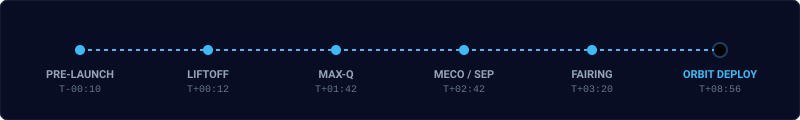

# Mission AX-01 Rocket Launch Simulator

A scroll-driven rocket launch hero section built with HTML5, CSS3, JavaScript, and GSAP ScrollTrigger. The scroll position directly scrubs through a unified animation timeline, tracking a rocket flight from pad ignition on Earth to payload deployment in orbit.



## Tech Stack

- HTML5: Semantic structure, inline SVG graphics, and layered DOM canvas elements.
- CSS3: Custom properties, absolute depth layering, responsive grid, and viewport-relative units.
- JavaScript ES6+: Modular animation controllers and optimized render loop.
- GSAP 3 & ScrollTrigger: Scroll-scrubbed timeline synchronization and easing functions.
- HTML5 Canvas API: High-performance particle generation for starfields, atmospheric clouds, and flame exhaust smoke.

## Flight Timeline Stages

The animation scrub timeline spans 100 timeline units mapped across 7 viewport heights of page scrolling:

| Timeline Progress | Mission Clock | Sequence Event | Description |
| :--- | :--- | :--- | :--- |
| 0% - 10% | T-00:10 | Pre-Launch Venting | Crew arm retracts and steam vents around the launch tower. |
| 13% - 17% | T-00:00 | Engine Ignition | First-stage engines ignite with pad glow and ground smoke accumulation. |
| 17% - 30% | T+00:12 | Liftoff & Ascent | Heavy vehicle climbs past mountain ridges with dynamic camera shake. |
| 36% - 50% | T+01:42 | Atmospheric Max-Q | Flight encounters maximum aerodynamic pressure as sky transitions to space. |
| 55% - 62% | T+02:42 | MECO & Separation | Main engine cutoff followed by stage 1 detachment. |
| 63% - 72% | T+03:20 | Stage 2 Ignition | Upper stage vacuum engine ignites; Earth horizon rotates into view. |
| 80% - 88% | T+03:40 | Fairing Jettison | Payload fairing halves peel away, exposing the satellite. |
| 90% - 100% | T+08:56 | Orbital Deployment | Upper stage shuts down and separates as satellite solar arrays unfold. |

## Interactive Technical Breakdown

<details>
<summary>Click to view Render Pipeline Architecture</summary>

### Single State Source of Truth

The simulation state is maintained in a central object (`S`). The ScrollTrigger timeline updates values on `S` during scrolling. A requestAnimationFrame ticker reads `S` on every frame and applies transform mutations to DOM nodes.

- Scroll events do not perform direct DOM manipulations.
- DOM style writes are guarded by an internal cache to prevent redundant writes.
- Particle calculations for smoke and starfield motes run independently inside Canvas rendering loops.

</details>

<details>
<summary>Click to view Project File Structure</summary>

```
d:/animation/
├── index.html              # Main HTML document and SVG rocket graphics
├── css/
│   └── style.css           # Global layout, scene depth layers, and HUD styling
├── js/
│   ├── main.js             # Core animation timeline, state scrub, and render loop
│   ├── sky.js              # Canvas starfield and cloud cluster generator
│   ├── smoke.js            # Particle engine for launch exhaust smoke
│   └── motes.js            # Floating atmospheric dust and ice particle engine
├── vendor/
│   ├── gsap.min.js         # GSAP animation engine
│   └── ScrollTrigger.min.js# GSAP ScrollTrigger plugin
└── assets/
    ├── rocket-launch.svg   # Animated header SVG
    └── flight-stages.svg   # Animated telemetry stage SVG
```

</details>

<details>
<summary>Click to view How to Run Locally</summary>

### Local Running Instructions

No build tools, bundlers, or package installations are required.

1. Clone or download this repository.
2. Open `index.html` directly in any modern web browser.
3. Alternatively, serve the directory with any static HTTP server:

```bash
# Using Node.js npx serve
npx serve .

# Using Python simple HTTP server
python -m http.server 8000
```

4. Scroll down on the page to scrub through the launch sequence.

</details>
